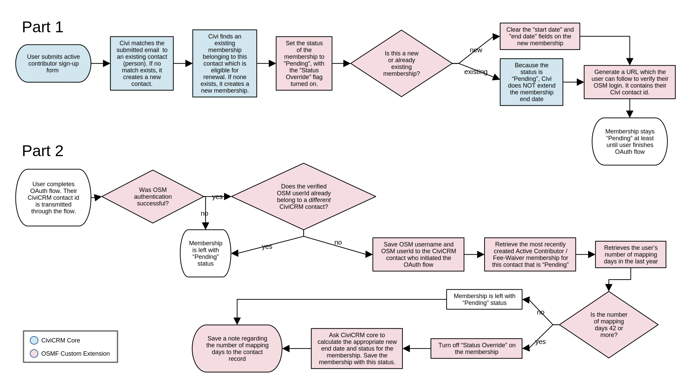
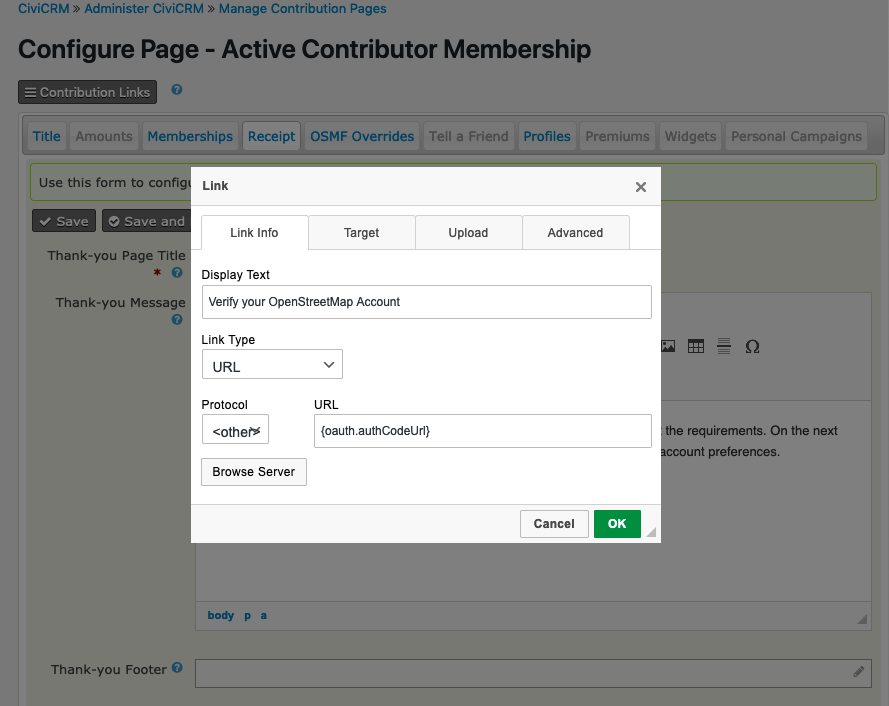

# osmf-verify-contributor

This custom extension, written specifically for OpenStreetMap Foundation's
membership site, provides tools to verify a person's OSM mapping contributions
when they sign up for a membership, and to modify the membership status
depending on those contributions.

The extension is licensed under [AGPL-3.0](LICENSE.txt).

## Requirements

* PHP v7.2+
* CiviCRM 5.39.0

## Installation (CLI, Git)

```bash
git clone https://github.com/lemniscus/osmf-verify-contributor.git
cv en oauth_client osmf_verify_contributor
```

## What the Extension Does



**It lets you create a link to start the OAuth process.** People sign up for 
memberships using Contribution Pages, even if no monetary contribution is
involved. A Contribution Page has a "thank-you page" which the user sees after
completing a membership "payment". This extension lets you create a special link on
the "thank-you page" to initiate OAuth authentication.

**It lets you simplify the "thank-you page".** Normally, the "thank-you page"
at the end of the membership "payment" process will show details of the "payment" ,
even if it was nothing. This extension lets you configure a Contribution Page
so that its "thank-you page" only shows a message of your choice,
which may include the OAuth link mentioned above.

**It sets the status of active contributor memberships to "pending" when they are
first created.** This extension overrides CiviCRM's behaviour when creating
memberships. If the membership being created is of the "Fee-waiver member",
"Active Contributor Associate Member" or "Active Contributor Normal Member"
type, it will not be active initially, but instead will have the status "pending".

**It saves the user's verified OSM username and ID to their record in Civi.**
When a person completes the OAuth process, demonstrating that they own an 
openstreetmap.org account, this extension saves their OSM user ID and username
to custom fields on their Civi contact record.

**It checks whether the user meets the criteria for an active contributor 
membership, and activates the membership if they do.** After a person 
demonstrates that they own an openstreetmap.org account (using the OAuth process),
this extension checks whether that account has enough mapping days in the past 
year to qualify the person for an active contributor membership. If so, the 
extension sets the status of the most recently created active contributor 
membership on the person's record to "new" or "current" as appropriate.

**It overrides the renewal process in a similar way.** When a person uses a 
contribution page to apply for membership renewal, this extension sets the status
of their existing membership to "pending". If they complete the OAuth process
and have enough mapping days to qualify, their membership will be reactivated 
and the renewal will be completed.

**It provides a message to the user telling them whether the membership sign-up
succeeded.** The messages are currently hard-coded.

## Configuration

### OAuth Permissions
This extension makes it possible for "anonymous" users -- people who aren't
logged in to your WordPress site -- to complete an OAuth process to verify
their account on openstreetmap.org. But first you must give them the
appropriate permission.

1. In the CiviCRM menu, click Administer > Users and Permissions.
2. Click WordPress Access Control.
3. Note which column belongs to "Anonymous". Find the row that says "CiviCRM:
create OAuth tokens via auth code flow". Check the box for "Anonymous" in that
row. Save the settings.

### OAuth Client

This extension makes **openstreetmap.org** available as an OAuth "Provider". 
You must create and register an OAuth "client" using this provider on the 
membership website (join.osmfoundation.org).

1. In CiviCRM, go to Administer > System Settings > OAuth.
2. In the list of providers, click on OpenStreetMap.
3. Follow the instructions on the screen.
   1. Copy the "Redirect URI" given in the instructions. It will be used in the next step.
   2. Follow instructions on the OpenStreetMap Wiki under ["OAuth 2.0: Registering
   your application as OAuth 2.0 consumer"](https://wiki.openstreetmap.org/wiki/OAuth#Registering_your_application_as_OAuth_2.0_consumer).
   Paste this redirect URI into the registration form on openstreetmap.org:
   `https://join.osmfoundation.org/civicrm/oauth-client/return/`
   in addition to any other URI that you copied from CiviCRM.
   3. Copy the Client ID and Client Secret into the form in CiviCRM.

### "Verify your eligibility" link

  1. In CiviCRM, go to Contributions > Manage Contribution Pages.
  2. Find the Contribution Page which you want to configure, click on the 
"Configure" menu for that page, and choose "Thank-you and receipting".
  3. Now, in the "Receipt" tab, edit the "Thank-you Message" field. Insert 
a link somewhere in the field, and set the URL of the link to
`{oauth.authCodeUrl}`.<br />

  4. Click the Save button.
  5. Optionally, simplify the Thank-you Page:
     1. Switch to the "OSMF Overrides" tab.
     2. Check the checkbox. This only applies to the Contribution Page that
     you're currently configuring.
     3. Click the Save button. 
     
### Custom fields

This extension expects you to have created two custom fields which it will use.
Both custom fields should be in the "OpenStreetMap user info" field set.

Go to Administer > Customize Data and Screens > Custom Fields. Create the two
fields.

- Verified OpenStreetMap User ID
- Verified OpenStreetMap Username

Both should be Alphanumeric text, database field length 255. Their names should
be entered exactly as shown above, so that their machine names will be 
`OpenStreetMap_user_info.Verified_OpenStreetMap_User_ID` and 
`OpenStreetMap_user_info.Verified_OpenStreetMap_Username`, respectively.
(Machine names are viewable in the API Explorer and Search Kit, if you need
to check). After they are saved the first time, you can change their labels to
something else if you want.

